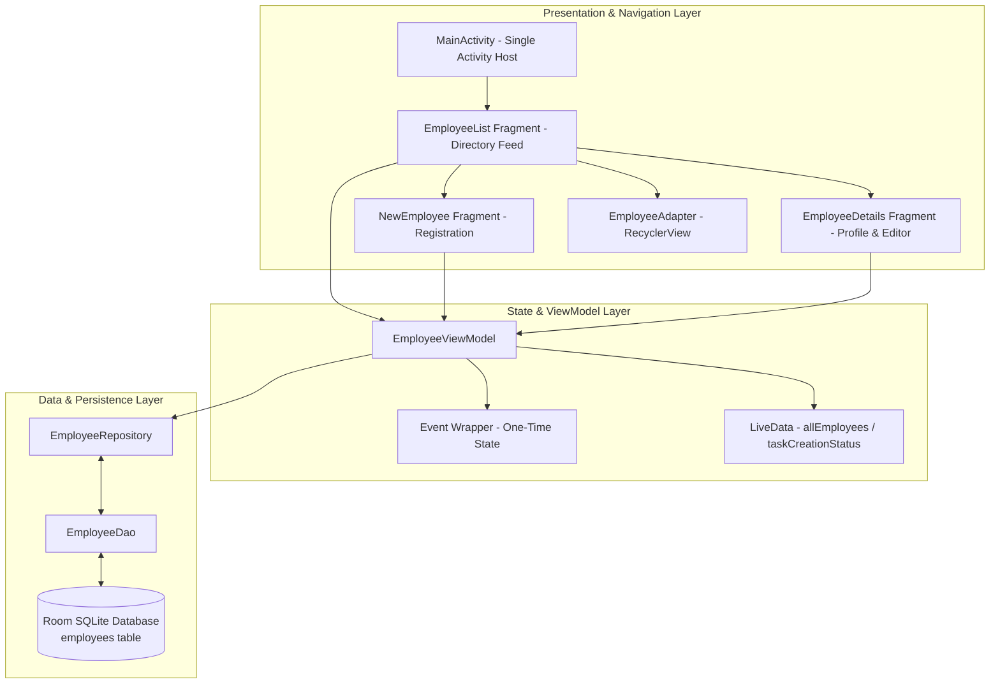

# Employee Management System

[](https://www.android.com/)
[](https://kotlinlang.org/)
[](https://developer.android.com/topic/architecture)
[-4CAF50?style=for-the-badge&logo=sqlite&logoColor=white)](https://developer.android.com/training/data-storage/room)
[](https://developer.android.com/)
[-00BCD4?style=for-the-badge)](https://developer.android.com/)
[](LICENSE)

> A robust Android human resources management and staff directory application built with Room SQLite persistence, Kotlin Symbol Processing (KSP), Jetpack Navigation, and reactive LiveData architecture.

---

## 📖 Overview

**Employee Management System** is a native Android HR utility designed for managing organizational directories, staff records, and personnel profiles on-device. Designed for internal corporate operations and small business admin teams, it offers rapid CRUD capabilities with strict offline data security.

The system handles complete employee lifecycle profiles (Name, Email, Phone, Office Address, Compensation/Salary, and Job Designation) backed by an embedded **Room SQLite** relational database compiled with **KSP**. Navigation is handled cleanly via Android Jetpack's Single-Activity architecture and Navigation Component.

### Key Highlights
- **Comprehensive HR Profiles**: Tracks detailed employee attributes including designation, salary, phone, email, and address.
- **Offline-First Data Security**: Corporate records remain safely on the device without requiring cloud access or third-party servers.
- **Modern Jetpack MVVM**: Structured around ViewModel state encapsulation, LiveData event observers, and Repository abstractions.
- **Parcelable Navigation**: Seamless data transmission between directory list, creation dialogs, and detail edit views.

---

## 🏗️ Architecture & Component Flow



---

## ✨ Core Features

### 🏢 Comprehensive Staff Directory
- Dynamic RecyclerView listing all organizational personnel ordered chronologically by ID.
- Contextual empty-state layout with instant prompt to register new staff.

### 📝 Full Employee Lifecycle CRUD
- **Registration**: Form validation capturing employee full name, official email, phone number, physical address, salary tier, and designation title.
- **Profile Inspector**: Dedicated detail screen for reviewing and updating existing staff credentials.
- **Secure Deletion**: Safe record removal with user confirmation safeguards.

### ⚡ Reactive State & Event Handling
- Utilizes custom `Event<T>` wrappers on LiveData streams to eliminate unwanted multiple-event triggers during screen rotations and configuration changes.
- Asynchronous database queries executed on Kotlin Coroutines IO dispatchers.

---

## 📱 Key Screens & UI Components

| Screen / Component | Class | Description |
|---|---|---|
| **Directory Feed** | `EmployeeList` | Primary directory dashboard displaying registered employees with Add FAB and empty state views. |
| **New Employee** | `NewEmployee` | Form screen for capturing and validating all employee attributes. |
| **Profile Details** | `EmployeeDetails` | Detail view providing editable fields for updating salary, designation, and contact info, plus delete actions. |
| **List Adapter** | `EmployeeAdapter` | RecyclerView adapter binding staff names, designations, and click navigation listeners. |
| **State Manager** | `EmployeeViewmodel` | AndroidViewModel exposing LiveData observers and coroutine launch functions. |

---

## 🛠️ Technical Stack Matrix

| Layer / Concern | Technology / Library | Version / Details |
|---|---|---|
| **Platform** | Android OS | `minSdk 24` (Android 7.0) / `targetSdk 35` (Android 15) / `compileSdk 35` |
| **Language** | [Kotlin](https://kotlinlang.org/) | 1.9+ |
| **Architecture** | MVVM + Repository Pattern | Android Jetpack Lifecycle (`ViewModel`, `LiveData`, `AndroidViewModel`) |
| **Database** | [Room Persistence Library](https://developer.android.com/training/data-storage/room) | SQLite ORM compiled with Kotlin Symbol Processing (KSP) |
| **Navigation** | Android Jetpack Navigation | SafeArgs / Parcelable Fragment navigation |
| **Concurrency** | Kotlin Coroutines | Asynchronous background database operations |
| **UI Components** | AndroidX & Material Design 3 | FloatingActionButton, RecyclerView, ViewBinding, Material CardView |
| **Build System** | Gradle Kotlin DSL (`build.gradle.kts`) | AGP 8.7+ |

---

## 📂 Project Structure

```text
Employee-Management-System/
├── app/
│   ├── src/
│   │   ├── main/
│   │   │   ├── java/com/example/tesla/
│   │   │   │   ├── MainActivity.kt                # Single-Activity host container
│   │   │   │   ├── adapter/
│   │   │   │   │   └── EmployeeAdapter.kt         # Staff directory RecyclerView adapter
│   │   │   │   ├── data/
│   │   │   │   │   ├── local/
│   │   │   │   │   │   ├── AppDatabase.kt         # Room database singleton
│   │   │   │   │   │   └── dao/EmployeeDao.kt     # Room DAO with CRUD queries
│   │   │   │   │   ├── models/Employees.kt        # Room Parcelable employee entity
│   │   │   │   │   └── repository/EmployeeRepository.kt # Repository layer
│   │   │   │   ├── ui/
│   │   │   │   │   ├── fragments/
│   │   │   │   │   │   ├── EmployeeList.kt        # Directory view
│   │   │   │   │   │   ├── NewEmployee.kt         # Staff registration form
│   │   │   │   │   │   └── EmployeeDetails.kt     # Profile editor & deletion view
│   │   │   │   │   └── viewmodel/EmployeeViewModel.kt # State ViewModel
│   │   │   │   └── utils/
│   │   │   │       └── Event.kt                   # One-time LiveData event wrapper
│   │   │   ├── res/
│   │   │   │   ├── layout/                        # XML layouts for fragments and items
│   │   │   │   ├── navigation/nav_graph.xml       # Navigation graph definition
│   │   │   │   └── values/                        # Color schemes, styles, and themes
│   │   │   └── AndroidManifest.xml
│   ├── build.gradle.kts
│   └── proguard-rules.pro
├── gradle/
│   └── libs.versions.toml
├── build.gradle.kts
├── LICENSE
└── README.md
```

---

## 🚀 Getting Started

### Prerequisites
- **Android Studio** (Ladybug 2024.2+ or Hedgehog+).
- **JDK 17** or **JDK 21**.
- Android device or Emulator running **API 24 (Android 7.0)** or higher.

### Installation & Build

1. **Clone the repository**:
   ```bash
   git clone https://github.com/shayann07/Employee-Management-System.git
   cd Employee-Management-System
   ```

2. **Open in Android Studio**:
   - Open the directory in Android Studio and let Gradle sync dependencies.

3. **Build the APK**:
   ```bash
   ./gradlew assembleDebug
   ```

4. **Install & Run**:
   ```bash
   ./gradlew installDebug
   ```

---

## 📄 License

This project is licensed under the **MIT License** — see the [LICENSE](LICENSE) file for complete details.

```text
Copyright (c) 2026 shayann07
```
